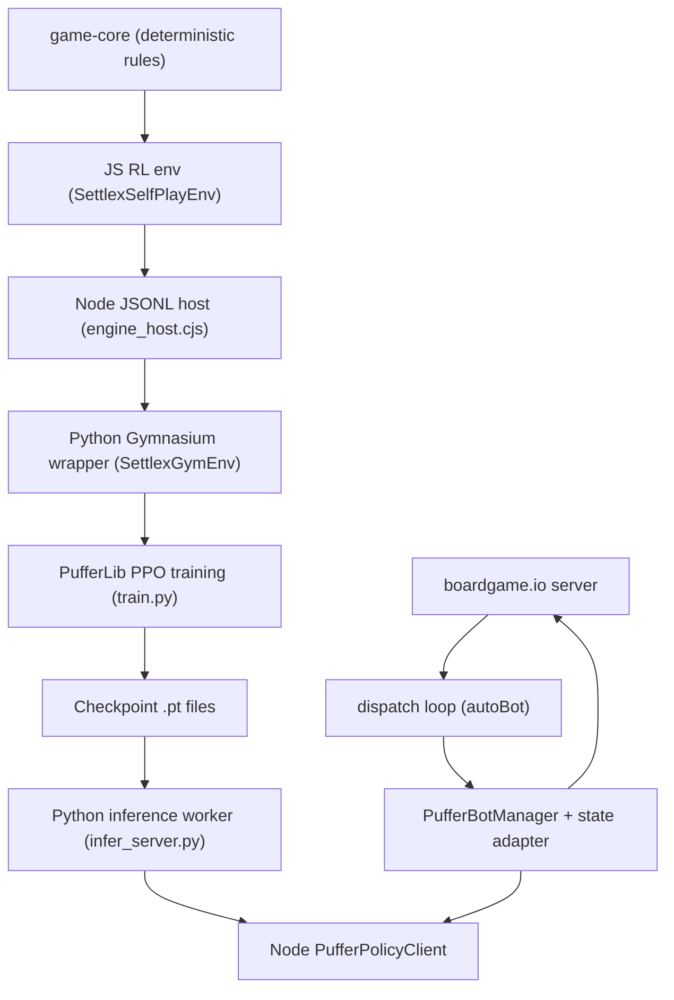

I’ve read the `superpowers:brainstorming` skill and I’m using it to structure this as a blogpost-grade “how we built it” dump (design decisions, architecture, implementation, debugging, and usage).

# Building A PufferLib Bot For Settlex (Catan): End-to-End Notes

This is a raw, high-verbosity writeup of what we implemented in this repo to (1) train a bot from an existing deterministic engine and (2) play against it in the existing web UI. You can treat it as “field notes” for a blogpost.

## Starting Point / Constraints

We already had:
- A deterministic, server-authoritative engine (`game-core/`) that exposes pure-ish rule functions like “compute legal build edges”, “apply move”, “score”, etc.
- A `boardgame.io` game implementation and UI (`app/catana/`) and a `boardgame.io` server (`server/`).

Constraints we chose:
- Do **not** rewrite or fork the engine for RL.
- Keep RL harness **isolated** from main app/server code.
- Make the RL environment deterministic and debuggable.
- Solve variable legal actions via **fixed action space + per-step action mask**.

> **Why this:** We wanted “RL as an integration layer”, not “RL as a rewrite.” The engine and the live game were already working; the goal was to add training and a playable bot without destabilizing the core rules or shipping a fork.
>
> **Tradeoffs:** This biases us toward solutions that are easy to wire and easy to debug (even if they’re slower) and away from “maximum throughput” simulator designs.

## Big Design Choices (What We Optimized For)

### 1) Fixed Discrete Action Space + Action Mask
Catan has huge “branching factor” and most actions are illegal most of the time. Instead of variable action lists, we:
- Define a **single** discrete action space that contains every possible action (every node placement, every edge placement, every robber tile, etc.).
- Provide a **mask** each step that marks legal actions.

This makes it compatible with common PPO-style pipelines and keeps inference simple.

> **Why this:** Most RL tooling (including PPO implementations) is happiest with a fixed-size discrete action space. The mask gives you “variable legal actions” without changing the space shape between steps.
>
> **Tradeoffs:** Big `N` means you spend capacity on actions that are rarely legal; exploration can be slow without good entropy settings and/or curriculum.
>
> **Alternatives:** Parameterized/hierarchical actions (multi-head policies, autoregressive action selection, `Dict` spaces). Often more sample-efficient, but also more custom glue and more ways for training vs serving to drift.

### 2) Turn-Based Multi-Agent As A Single Gymnasium Environment
Instead of wiring true multi-agent training:
- The environment’s “agent” is “whoever is to act now”.
- The observation includes a one-hot “which seat is acting” plus a partial-information encoding of game state.

Training then becomes symmetric self-play: one policy learns to play for any seat.

> **Why this:** It’s the simplest thing that works: one env, one policy, one optimizer. No multi-agent API, no per-agent replay buffers, no cross-policy coordination.
>
> **Tradeoffs:** Self-play is non-stationary and evaluation gets tricky. You can “get better” against your current self and still be weak overall, or regress without noticing.
>
> **Alternatives:** True multi-agent envs (PettingZoo AEC), population-based training, checkpoint leagues. Better long-term, but more code and operational complexity.

### 3) Partial Observability In The Observation (Not In The Engine)
We have full engine state server-side, but the policy should not see opponents’ private hand types.
So the env encodes:
- For the acting player: resource counts by type, dev cards by type.
- For opponents: only total counts (or zeros for type breakdown), which are public-ish.

> **Why this:** We want the bot to “play the real game” under information constraints without rewriting engine state. The env becomes the place where we enforce what’s visible.
>
> **Tradeoffs:** A feed-forward policy is effectively “memoryless.” It can’t remember prior trades/steals/roll history unless we explicitly encode that history.
>
> **Alternatives:** Add explicit history features, add an RNN/transformer policy, or implement belief-state tracking. More power, more tuning, harder serving.

### 4) Deterministic RNG + Seeded Episodes
For debugging and reproducibility:
- `reset(seed)` generates the board deterministically and shuffles dev deck deterministically.

> **Why this:** Determinism makes debugging possible. When something weird happens (robber stage, forced placement), you can replay the exact seed and reproduce it.
>
> **Tradeoffs:** If you accidentally correlate “seed” with other episode structure, you can overfit to a narrow distribution. (We mitigate by sampling many seeds.)

### 5) Ship A “Play Against Bot” Path
We didn’t stop at offline training. We integrated the trained policy into the server so humans can play it via:
- A “Play Against Bot” button
- A “Fill Open Seats With Bots” button on match lobby

This meant building an **adapter** between live `boardgame.io` match state and the RL env’s action schema.

> **Why this:** Training metrics are not the same as “feels good to play against.” Shipping the playable bot early surfaces real integration bugs (ruleset mismatch, stage mismatch, shape mismatch) that you won’t catch in offline loops.
>
> **Tradeoffs:** Live integration increases surface area and requires careful fallbacks so the game never gets stuck when inference fails.

## High-Level Architecture

Mermaid-ish mental model:



Key idea: the JS env defines the canonical action schema; both training and live play reuse it.

## Step 1: Build A Deterministic Self-Play Env (JS)

We implemented a self-contained environment in JS so it can directly import and call the engine JS build.

> **Why this:** The canonical action schema and legality logic live in one place. Both training and live play reuse the same code paths, which reduces “trained on one thing, served on another” errors.
>
> **Tradeoffs:** JS stepping speed is not as fast as a tight native simulator. If you’re compute-bound on environment steps, you’ll eventually want a faster core (Rust/C++) or a more vectorized design.
>
> **Alternatives:** Implement the env in Python around a Python port of the engine, or rewrite the engine in Rust and expose it to both Node and Python. Faster long-term, but large rewrite risk.

Core file:
- `ai/pufferlib/js/settlexEnv.cjs:99`

### Env responsibilities
The env owns:
- A `GameState` (`this.state`) from `game-core` plus topology + tiles.
- Turn/phase mechanics (placement, main phase, robber, dev-card side modes).
- The fixed action space layout and the per-step action mask.

It exposes:
- `reset(seed)` -> `{ observation, actionMask, mode, actorId, ... }`
- `step(action)` -> same shape, plus reward and done/truncated flags
- `getSpec()` -> actionCount/observationSize/actionLabels/etc.

### Ruleset alignment (1v1 vs 3–4p)
We added `rulesetId: "auto" | "duel" | "standard"` and made `auto` choose duel for 2p:
- `ai/pufferlib/js/settlexEnv.cjs:82`
- `ai/pufferlib/js/settlexEnv.cjs:326`
- Regression tests: `ai/pufferlib/js/__tests__/settlexEnv.test.js:14`

This matters because 2p “duel” rules are different:
- `game-core/src/ruleset.ts:77`

### Action space layout
The env constructs a discrete action space with offsets:
- roll/endTurn/buyDevCard
- build road for every edge
- place settlement for every node
- build city for every node
- maritime trades (give->receive pairs)
- explicit dev-card actions (knight, road building, monopoly, year-of-plenty)
- move robber to each land tile

That comes from:
- `_configureActionSpace` (see `ai/pufferlib/js/settlexEnv.cjs:372`)
- `_actionLabel` / `_decodeAction` (same file)

We deliberately added explicit “play dev card” actions because otherwise you end up with awkward multi-step “meta actions” that are hard to learn and hard to keep legal:
- dev-card labels exist and are tested: `ai/pufferlib/js/__tests__/settlexEnv.devCards.test.js:6`

> **Why this:** “Explicit” dev-card actions keep the policy’s job simple: pick a concrete thing you want to do now. The env/engine can enforce legality and drive any required sub-modes.
>
> **Tradeoffs:** It expands the action space and commits you to stable indexing. Once you publish a checkpoint, action-space changes invalidate it.
>
> **Alternatives:** Hierarchical dev-card actions (choose “play dev card” then choose type then choose target). More compact, but higher implementation complexity and more ways to accidentally allow illegal intermediate states.

### Legal action mask
At each step we compute `mask[actionId] ∈ {0,1}` based on core legality checks:
- `ai/pufferlib/js/settlexEnv.cjs:675`

Example:
- In `preRoll`, only `roll` and any legal dev-card plays are enabled.
- In `robberMove`, only legal robber tiles are enabled (with a fallback if “don’t place on current robber tile” would otherwise yield zero).

### Observation vector
We build a dense float vector of features, then append the action mask:
- base features at `ai/pufferlib/js/settlexEnv.cjs:1098`
- mask appended in `_buildOutput` at `ai/pufferlib/js/settlexEnv.cjs:1196`

> **Why this:** Dense vectors are the lowest-friction representation for an MLP policy. Appending the mask to the observation also makes it easy for both trainer and inference worker to operate on a single tensor shape.
>
> **Tradeoffs:** Catan is naturally a graph (nodes/edges/tiles); flattening loses inductive bias. MLPs can still learn, but you’ll typically need more data/compute than a GNN-style model.
>
> **Alternatives:** Graph neural nets over the board, attention over node/edge embeddings, or a hybrid that encodes local neighborhoods. More performance potential, more engineering and serving complexity.

Notable features:
- Mode one-hot (placement, preRoll, postRoll, robberMove, etc.)
- Acting player one-hot
- Per-player public stats (VP, hand sizes, remaining pieces, awards)
- Private details only for the acting player (resource types, dev-card types)
- Board occupancy: buildings-by-node, roads-by-edge
- Robber tile one-hot, last roll one-hot, bank counts
- A normalized step counter

### Rewards
We used simple shaped reward:
- Reward includes delta victory points (scaled), a step penalty, an illegal-action penalty, and terminal win/loss reward.
- You can see this in `step()` logic near `ai/pufferlib/js/settlexEnv.cjs:289` (and options defaulting earlier).

This is “good enough” for early iterations; for world-class play you’d likely revisit reward shaping and/or use sparse terminal-only rewards.

> **Why this:** Shaping helps early learning in a long-horizon game. Without shaping, the policy can take a long time to learn basic competence (especially on CPU).
>
> **Tradeoffs:** Shaping can bias the learned strategy (e.g. “optimize VP deltas” vs “optimize win probability”). It also makes cross-run comparisons harder when you tweak reward terms.
>
> **Alternatives:** Pure sparse terminal reward (win/loss only) with much more training, or auxiliary objectives (predict VP, predict legality, predict future resource gain) to help representation learning.

### Simplifications / omissions
The RL harness intentionally omits some hard UI/negotiation bits:
- Player-driven discard choice (auto-resolved)
- Player-to-player trades
- VP dev cards aren’t explicit “play” actions

Those are documented in `ai/pufferlib/README.md:1`.

> **Why this:** These mechanics are either (a) negotiation-heavy (trades), or (b) require additional “choose which cards” micro-actions that would balloon the action space and slow iteration. We prioritized a strong baseline bot first.
>
> **Tradeoffs:** The resulting bot is not “full rules” Catan. You can still ship it as a bot for your variant, but don’t claim it’s solving the entire tabletop game.

## Step 2: Make It Callable From Python (JSONL Host + Gymnasium Wrapper)

### Node JSONL host
We created a tiny process wrapper so Python can talk to the JS env via stdin/stdout:
- `ai/pufferlib/js/engine_host.cjs:1`

> **Why this:** JSONL over stdin/stdout is the simplest cross-language bridge that works everywhere. It avoids native build tooling, keeps failures isolated to a subprocess, and is easy to log/replay when debugging.
>
> **Tradeoffs:** JSON serialization + process IPC adds overhead. If you scale to huge env counts, this becomes a bottleneck.
>
> **Alternatives:** Native bindings (N-API/pybind), an HTTP/gRPC microservice, or running training in Node. Faster or cleaner in some ways, but each adds toolchain complexity and new failure modes.

Protocol:
- `{"cmd":"init","options":{...}}`
- `{"cmd":"spec"}`
- `{"cmd":"reset","seed":123}`
- `{"cmd":"step","action":456}`
- `{"cmd":"close"}`

We normalize CLI/env options (numPlayers/maxSteps/etc.) in:
- `ai/pufferlib/js/engine_host.cjs:41`

### Python host client
Python spawns that Node host process and reads/writes JSONL:
- `ai/pufferlib/python/settlex_puffer/bridge.py:19`

Notes:
- Node binary is configurable via `SETTLEX_NODE_BINARY`.
- This is kept simple and robust; if the host dies, we throw a nice error.

### Gymnasium env wrapper
We wrap the JSONL client into a Gymnasium environment:
- `ai/pufferlib/python/settlex_puffer/env.py:11`

Key behavior:
- Convert JS payload -> `(obs, reward, done, truncated, info)`
- Put `action_mask`, `actor_id`, and `mode` into `info` for downstream code.

## Step 3: Define A Masked Policy (Torch)

We implemented a minimal PPO-friendly network:
- `ai/pufferlib/python/settlex_puffer/policy.py:10`

Important design:
- Observation layout is `[base_features..., action_mask...]`.
- The policy *itself* applies hard masking: illegal logits are set to `-inf`:
  - `ai/pufferlib/python/settlex_puffer/policy.py:45`

This way, the policy can’t “want” illegal actions; and if your downstream sampling still picks one (e.g. numeric issues), you catch it quickly.

> **Why this:** Action-masking “in the model” is defense-in-depth. Even if a downstream sampler or integration bug tries to sample an illegal action, logits for illegal actions are effectively removed.
>
> **Tradeoffs:** The observation now contains the mask, so observation dimensionality is tied to action-space size. Any action-space change is a checkpoint-breaking schema change.
>
> **Alternatives:** Pass the mask separately (not appended) and use a custom distribution wrapper, or do legality enforcement only in the env. Cleaner “feature vector,” but easier for bugs to surface in serving.

## Step 4: Train With PufferLib

Training entrypoint:
- `ai/pufferlib/python/settlex_puffer/train.py:35`

We use PufferLib’s `pufferl.train` with a default config and then override key settings:
- `ai/pufferlib/python/settlex_puffer/train.py:104`

> **Why this:** PufferLib gives a practical PPO loop with good instrumentation and a simple “bring your own Gym env + Torch policy” shape. We optimized for shipping training quickly rather than building an RL stack from scratch.
>
> **Tradeoffs:** PPO is not the only way to get strong play; and “world class” often needs league training, evaluation infrastructure, and lots of environment throughput.
>
> **Alternatives:** Stable-Baselines3 / CleanRL (simplicity), Sample Factory (throughput), RLlib (distributed), or a bespoke self-play system (maximum control).

Notable defaults we tuned for local:
- `--minibatch-size` defaults to `128` (much smaller than Puffer’s default config expects)
- If `batch_size=auto`, we clamp minibatch <= inferred batch so short runs don’t fail.

### Local setup commands (from repo root)
```bash
pnpm -C game-core build

cd ai/pufferlib/python
uv venv
source .venv/bin/activate
uv pip install -e .
```

### Smoke test (random policy)
```bash
cd /Users/david/coding/settlex/ai/pufferlib/python
source .venv/bin/activate
python -m settlex_puffer.smoke --steps 500 --num-players 2
```

### Train
```bash
cd /Users/david/coding/settlex/ai/pufferlib/python
source .venv/bin/activate

python -m settlex_puffer.train \
  --device cpu \
  --num-players 2 \
  --num-envs 12 \
  --total-timesteps 2000000 \
  --output-dir /Users/david/coding/settlex/ai/pufferlib/runs-1v1-duel
```

What you see:
- A live PufferLib dashboard (SPS, losses, entropy, plus our custom env stats like legalActionCount).
- Checkpoints written periodically as `model_XXXXXX.pt`.

Optional remote logging:
```bash
python -m settlex_puffer.train ... --wandb --wandb-project settlex --wandb-group puffer
```

## Step 5: Evaluate Checkpoints (Quick Signal)

Evaluation script:
- `ai/pufferlib/python/settlex_puffer/evaluate.py:14`

This evaluates “policy controls player-id X, all other seats are random legal”:
```bash
cd /Users/david/coding/settlex/ai/pufferlib/python
source .venv/bin/activate

python -m settlex_puffer.evaluate \
  --checkpoint /Users/david/coding/settlex/ai/pufferlib/runs-1v1-duel \
  --episodes 200 \
  --player-id 0 \
  --num-players 2
```

It prints JSON: winRate, truncated episodes, mean steps, etc.

This is not a perfect metric (random opponents are weak), but it’s a fast regression signal.

> **Why this:** “Vs random legal” is cheap, deterministic-ish, and works as a smoke/regression test for obvious breakage (e.g. policy getting stuck, illegal actions, failing to win from advantaged states).
>
> **Tradeoffs:** It’s easy to overfit to beating random. A bot can look great vs random and still be mediocre vs competent play.
>
> **Alternatives:** Elo ladder vs a checkpoint league, fixed-seed evaluation suites, or head-to-head matches vs scripted baselines (fast expanders, port priority, etc.).

## Step 6: Serve The Policy For Live Games (Inference Worker)

We implemented a lightweight JSONL inference worker:
- `ai/pufferlib/python/settlex_puffer/infer_server.py:1`

Why a worker process?
- Keep server JS clean.
- Load Torch checkpoint once.
- Make inference requests cheap and persistent.

Important safety:
- It validates obs/action shapes and errors if they don’t match checkpoint dimensions:
  - `ai/pufferlib/python/settlex_puffer/infer_server.py:133`
- It overwrites the observation’s trailing mask to match the request mask (defense-in-depth):
  - `ai/pufferlib/python/settlex_puffer/infer_server.py:70`

This prevents “mask drift” bugs.

> **Why this:** Serving needs to be robust. Shape checks + mask overwrite make failures obvious and prevent “silent wrongness” where the model thinks it’s sampling legal actions but indices no longer match.
>
> **Tradeoffs:** Any schema mismatch becomes a hard error (then we fall back). Operationally that’s good, but it means you must manage checkpoints as versioned artifacts.

## Step 7: Plug The Bot Into The `boardgame.io` Server

### Server wiring
Boardgame server is started in:
- `server/server.js:1`

We create a bot manager from env vars:
- `server/server.js:11`
- `server/bots/pufferBotManager.js:190`

And we schedule bot actions using the timer manager (quick `autoBot` ticks):
- `server/timers/TimerManager.js:279`

### Dispatch path
All auto moves and bot moves go through:
- `server/dispatch/dispatchMatchUpdate.js:13`

Key flow:
- Fetch state+metadata once
- If move is `autoBot`, ask botManager for planned move(s)
- Dispatch each planned move as a `MAKE_MOVE` action
- Fetch once at end to resync metadata/bot seat detection

This keeps DB reads low and supports multi-move sequences (e.g. some dev card actions map to start+confirm).

> **Why this:** We reused the existing `autoBot` dispatch path so bots behave like any other server-driven automatic move. That keeps the integration small and avoids inventing a parallel “bot server.”
>
> **Tradeoffs:** You must be careful about timing loops and re-entrancy (don’t spam moves, avoid infinite bot cycles). We added explicit move delays and safe fallbacks.
>
> **Alternatives:** A separate bot service that calls a server API to submit moves. Cleaner separation, but more infrastructure and more network failure modes.

### Bot manager (seat detection + fallback)
Bot manager:
- `server/bots/pufferBotManager.js:61`

Notable behaviors:
- Detect bot seats either via env var `SETTLEX_BOT_PLAYER_IDS` or via lobby seat `data.bot` / `data.isBot` / name:
  - `server/bots/pufferBotManager.js:99`
- Build RL observation+mask via the adapter; if adapter fails or actor mismatch, fall back to safe auto moves:
  - Actor mismatch fallback was the source of the “forced placements” bug; details below.
- If inference fails (checkpoint mismatch, venv issue), log once and disable policy, then fall back to random legal:
  - `server/bots/pufferBotManager.js:158`

### The live state adapter (critical piece)
Adapter:
- `server/bots/pufferStateAdapter.js:222`

Responsibilities:
- “Hydrate” a `SettlexSelfPlayEnv` instance from live `G/ctx` so it can reuse:
  - `_getActorId()` logic
  - `_getMode()` logic
  - `_computeActionMask()`
  - `_decodeAction()` / action labels
- Build the exact same observation schema as training (including appended mask).
- Map the decoded action into one or more boardgame moves (some dev cards require 2 moves).

Hydration is in:
- `server/bots/pufferStateAdapter.js:87`

> **Why this:** Hydrating the RL env from live `G/ctx` lets us reuse the exact same action decoding, action labels, and action mask logic from training. That keeps “training” and “serving” semantics aligned.
>
> **Tradeoffs:** You are effectively maintaining a mapping between `boardgame.io` state machine and the RL env’s internal mode machine. When either changes, you need tests to ensure they still match (we added a couple after the robber/placement bugs).
>
> **Alternatives:** Implement a separate “legal actions + observation builder” specifically for live play. Sometimes simpler short-term, but tends to drift from the training env unless you’re extremely disciplined.

Two key fixes we had to make after real playtesting:
1. Mode override from boardgame stage so we don’t accidentally show `roll` while stage is `moveRobber`:
   - `server/bots/pufferStateAdapter.js:66`
2. Placement actor inference must not depend only on raw `ctx.turn` because placement begins after preGame and turn counts can be offset:
   - `server/bots/pufferStateAdapter.js:28`

Without (2), the adapter would sometimes say actorId != ctx.currentPlayer during the bot’s second placement, which triggered immediate fallback auto placement.

### Policy client inside server
The server spawns the Python inference worker and speaks JSONL:
- `server/bots/PufferPolicyClient.js:4`

The bot uses:
- `SETTLEX_PUFFER_CHECKPOINT`
- `SETTLEX_PUFFER_PYTHON` (points at the venv python)
- `SETTLEX_PUFFER_PYTHON_CWD` (optional)
- `SETTLEX_PUFFER_STOCHASTIC=1` (optional)

## Step 8: Add UI Hooks (“Play Against Bot”)

We integrated bot play into the existing Catana lobby pages.

### “Play Against Bot” button (main lobby)
This creates a 2-player match, joins you as seat 0, joins seat 1 with bot metadata, and routes you into the match:
- `app/catana/lobby/LobbyPageClient.js:697`

It tags the bot seat with:
- `data.bot = "puffer"`
- `data.isBot = true`

So the server can detect bot seats dynamically.

> **Why this:** Marking seats as bots via seat metadata keeps the server stateless: you don’t need a special “bot match type,” and you can mix humans and bots in any lobby.
>
> **Tradeoffs:** You need to ensure metadata is validated/sanitized server-side so clients can’t spoof things that break games. (We mostly treat bot metadata as a hint, not a trust boundary.)
>
> **Alternatives:** Dedicated “play vs AI” endpoints or match types. More explicit, but more UI and server branching.

### “Fill Open Seats With Bots” (match lobby)
For any match (2–4 players), you can fill remaining open seats with bots:
- `app/catana/lobby/[matchID]/MatchPageClient.js:249`

### 1v1 rules default
To align “matchmaking default” with our desired 1v1 mode (15 VP, discard 9), we made 2-player games resolve to duel rules by default:
- `app/catana/Game.js:86`
- `game-core/src/ruleset.ts:77`
- RL env mirrors that now via `rulesetId: auto`:
  - `ai/pufferlib/js/settlexEnv.cjs:82`

## Debugging + Gotchas (The Stuff You Only Learn By Playing It)

### 1) Checkpoint shape mismatch
If you change observation feature count or action count (e.g. adding dev-card actions), old checkpoints won’t load.
Symptoms:
- Inference worker errors like “size mismatch” or “Shape mismatch for loaded policy”.
- Server falls back to random legal actions (or stage auto moves).

Where it’s handled:
- Shape checks in `ai/pufferlib/python/settlex_puffer/infer_server.py:129`
- Server fallback in `server/bots/pufferBotManager.js:158`

Practical rule: treat “observation schema changes” as a new model version; retrain.

### 2) Robber/knight flow mismatch (stage vs core phase)
We hit a real-world mismatch where boardgame stage was `moveRobber` but core turn phase could still be `preRoll`, and the adapter incorrectly exposed `rollDice`.
Fix:
- Mode override from `ctx.activePlayers` in `server/bots/pufferStateAdapter.js:66`

### 3) Instant “forced:placeSettlement/forced:placeRoad”
This wasn’t the policy choosing randomly; it was fallback auto-moves.
Those logs are produced only by:
- `app/catana/Moves.js:559` and `app/catana/Moves.js:581`

The fallback trigger was:
- `adapter.actorId !== playerID` check:
  - `server/bots/pufferBotManager.js:149`

Root cause was placement indexing (turn offset). Fix:
- Anchor placement index to `ctx.currentPlayer`:
  - `server/bots/pufferStateAdapter.js:28`

### 4) Gym warning noise
You may see runtime warnings about Gym being unmaintained. Our code uses Gymnasium (`ai/pufferlib/python/settlex_puffer/env.py:5`), but some dependency chain prints the Gym warning anyway. It’s noisy but not blocking.

## How To Run Everything (One Place)

### Train
```bash
pnpm -C /Users/david/coding/settlex/game-core build

cd /Users/david/coding/settlex/ai/pufferlib/python
source .venv/bin/activate

python -m settlex_puffer.train \
  --device cpu \
  --num-players 2 \
  --num-envs 12 \
  --total-timesteps 2000000 \
  --output-dir /Users/david/coding/settlex/ai/pufferlib/runs-1v1-duel
```

### Evaluate (quick)
```bash
cd /Users/david/coding/settlex/ai/pufferlib/python
source .venv/bin/activate

python -m settlex_puffer.evaluate \
  --checkpoint /Users/david/coding/settlex/ai/pufferlib/runs-1v1-duel \
  --episodes 200 \
  --player-id 0 \
  --num-players 2
```

### Play against bot
```bash
pnpm -C /Users/david/coding/settlex/game-core build

SETTLEX_BOT_PLAYER_IDS=1 \
SETTLEX_BOT_MOVE_DELAY_MS=450 \
SETTLEX_PUFFER_CHECKPOINT=/Users/david/coding/settlex/ai/pufferlib/runs-1v1-duel/<some model_*.pt> \
SETTLEX_PUFFER_PYTHON=/Users/david/coding/settlex/ai/pufferlib/python/.venv/bin/python \
pnpm serve
```

Then open the web UI and click:
- “Play Against Bot” (main lobby), or
- Create a match and then “Fill Open Seats With Bots” (match lobby).

## “What’s The Bot Size / How Hard Is It To Serve?”
Our current MLP checkpoints are small (around ~1MB per `.pt` snapshot). Inference is CPU-friendly but still runs via Python+Torch, so for online scale you’d likely:
- run 1 worker per game server instance (or a pool),
- consider batching or model export (TorchScript/ONNX) later,
- keep the bot move delay (`SETTLEX_BOT_MOVE_DELAY_MS`) slightly above 0 to avoid churn and to keep the UI readable.

> **Why this:** For early deployments, “Python worker + Torch” is the quickest way to ship. If you later need to serve thousands of games concurrently, you’ll probably move to an exported model/runtime, reduce IPC overhead, and/or scale inference separately from the game server.

## Key Files Index (Quick Links)
- RL env: `ai/pufferlib/js/settlexEnv.cjs:99`
- JSONL host: `ai/pufferlib/js/engine_host.cjs:1`
- Gymnasium wrapper: `ai/pufferlib/python/settlex_puffer/env.py:11`
- Python bridge: `ai/pufferlib/python/settlex_puffer/bridge.py:19`
- Policy: `ai/pufferlib/python/settlex_puffer/policy.py:10`
- Training: `ai/pufferlib/python/settlex_puffer/train.py:35`
- Eval: `ai/pufferlib/python/settlex_puffer/evaluate.py:14`
- Inference worker: `ai/pufferlib/python/settlex_puffer/infer_server.py:1`
- Bot manager: `server/bots/pufferBotManager.js:61`
- Policy client: `server/bots/PufferPolicyClient.js:4`
- State adapter: `server/bots/pufferStateAdapter.js:222`
- Server wiring: `server/server.js:1`
- Dispatch: `server/dispatch/dispatchMatchUpdate.js:13`
- Bot scheduler: `server/timers/TimerManager.js:279`
- Play vs bot UI: `app/catana/lobby/LobbyPageClient.js:697`
- Fill seats UI: `app/catana/lobby/[matchID]/MatchPageClient.js:249`
- Forced placement moves (debug signal): `app/catana/Moves.js:559`
- Duel rules: `game-core/src/ruleset.ts:77`

## Optional “World-Class” Upgrades (If You Want This Post To End With A Roadmap)
What we built is a strong baseline for a shippable bot, but “world class” usually adds:
- league/population training (play vs past checkpoints, not only mirror self-play)
- stronger evaluation (Elo ladder, fixed seeds, seat balancing)
- more compute/timesteps
- better opponent modeling / memory (RNN) and/or search/planning at inference

If you want, I can write a follow-up section describing a minimal “checkpoint league + Elo gating” design that fits this codebase without huge refactors.

## Update: Relational Encoder + Search (Implemented)

Since the baseline described above, we implemented the first major performance-oriented upgrades:

### 1) Observation schema v2 (explicit board layout features)
- Added per-tile features (resource type, number token, pip weight, robber flag).
- Added per-node features (port type, adjacent pip totals by resource, total pips, occupancy by player/building type).
- Added per-edge ownership features (unowned + owner one-hot).
- Added schema metadata to env specs:
  - `observationLayout`
  - `observationSchemaHash`
  - `actionSpaceHash`

Serving now receives this metadata from the state adapter and can reject mismatched checkpoint schemas instead of silently drifting.

### 2) Factorized relational policy
- New policy file: `ai/pufferlib/python/settlex_puffer/policy_factorized.py`.
- Architecture:
  - token projections for global/tile/node/edge groups
  - small attention stack
  - factorized action scoring (action type + location/resource factors)
- `train.py` now supports:
  - `--policy-arch factorized-relational` (default)
  - `--policy-arch masked-mlp` (fallback)
- `evaluate.py` auto-detects architecture from checkpoint keys.
- `infer_server.py` loads either architecture and validates schema hashes when provided.

### 3) Optional expectimax-style search at inference
- New search module: `server/bots/pufferSearch.js`.
- Manager wiring in `server/bots/pufferBotManager.js`.
- Inference worker modes added:
  - `score_actions` (masked logits + value)
  - `eval_batch` (batched value scoring)
- Enable in server env:
  - `SETTLEX_PUFFER_SEARCH=expectimax`
  - `SETTLEX_PUFFER_SEARCH_BUDGET_MS` (default `250`)
  - `SETTLEX_PUFFER_SEARCH_TOPK` (default `12`)
  - `SETTLEX_PUFFER_SEARCH_MAX_DEPTH` (default `2`)

### 4) Critical bug fixed during factorization
- We fixed a node-factor indexing bug where duplicated node labels from `placeSettlement:*` and `buildCity:*` could overflow node-token indices.
- Regression test added: `ai/pufferlib/python/tests/test_policy_factorized.py`.
